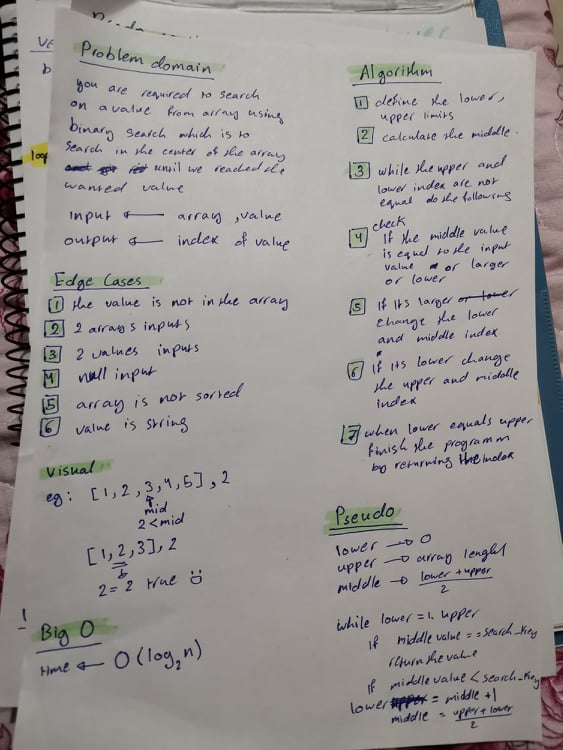

# Binary Search of Sorted Array
<!-- Description of the challenge -->
it requires to find a value based on binary search and return its index
binary search --> is the search we did on a sorted array the check the center value of the data set and 
see if the value matches it or its biggrt or smaller then exceulde the false one and try again and agin in the cental value and excelude the false part until we reached to the value 

## Whiteboard Process
<!-- Embedded whiteboard image -->

## Approach & Efficiency
<!-- What approach did you take? Discuss Why. What is the Big O space/time for this approach? -->

I taked the approach of narrowing the lowe and upper limits until I reashed to the target 

the big O(log2 n)

