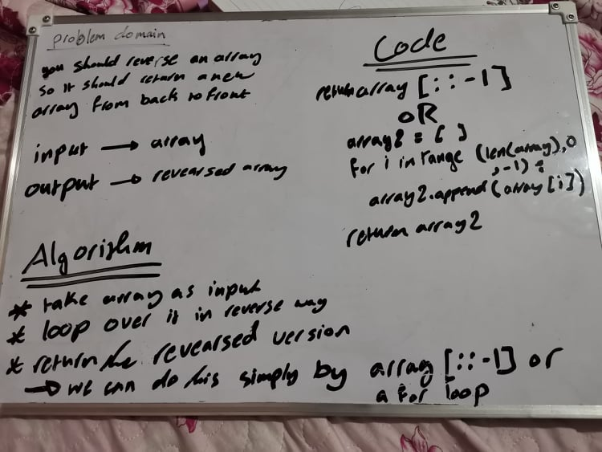

# Reverse an Array
the challenge requires us to make a function that is responsible of reverse a list and return the reversed version

## Whiteboard Process

## Approach & Efficiency

<!-- What approach did you take? Discuss Why. What is the Big O space/time for this approach? -->

I used the property of indexing that allows us to reverse string by index it be -1 step 
it work in the efficency of O(n)