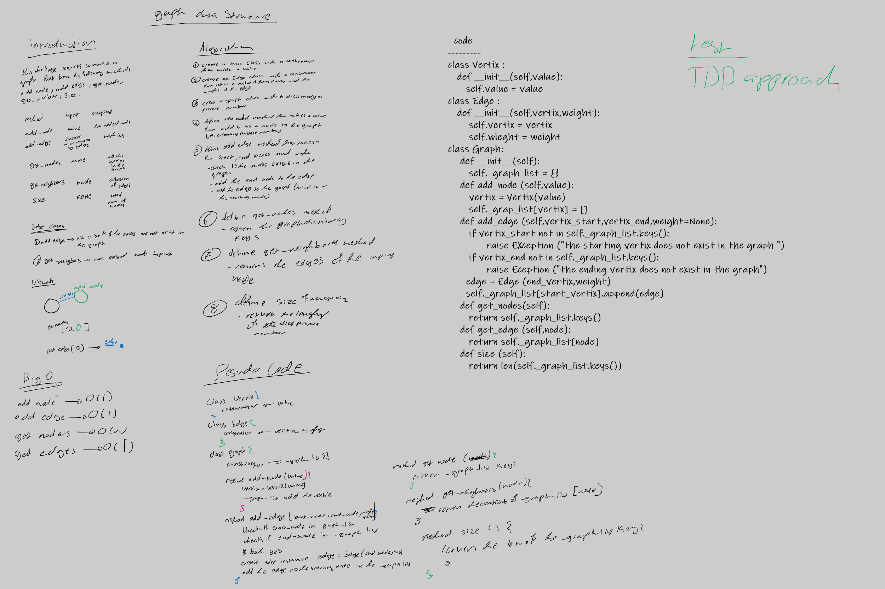

# Graphs
<!-- Short summary or background information -->
graph is a data structure thatcontaines vertices and may have a bond between them called edge 

the graph have multiple ways to describe it as 

1- cyclic and acyclic

2- complete and none complete 

3- directed and none directed 

## Challenge
<!-- Description of the challenge -->
the challenge require us to make a graph with its methods 

add_node -> adds a node to the graph

add_edge -> adds edge between two vertices in the graph

get_nodes -> get all the vertices in the graph 

get_neighbors -> get all the neighbor vertices for a specific node (vertix) 

size -> gives the size of the graph (how many nodes in the graph)

## Approach & Efficiency
<!-- What approach did you take? Why? What is the Big O space/time for this approach? -->

**Approach**

add_node -> using assigntment approach (adding the node directly to a graph inner dictionary as a key)

add_edge -> using assigntment approach (adding edgedirextly to the graph inner dictionary as a value)

get_nodes -> return the kys of the graph inner dictionary  

get_neighbors -> return all the values for a spicific key in the graph inner dictionary 

size -> return the length of the graph inner dictionary  

**Efficiency**

add_node -> O(1) time and space

add_edge -> 

    O(1) time and space ,

    O(n) time when adding the edge cases

get_nodes -> O(n) time and space because it loops over the keys and put them in array

get_neighbors -> O(1) thime and space 

size -> O(1)

## API
<!-- Description of each method publicly available in your Graph -->
[code](graph.py)

[test](../tests/test_graph.py)

