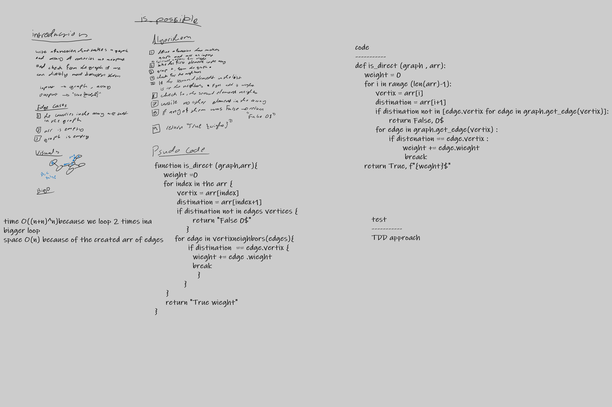

# Challenge Summary
<!-- Description of the challenge -->
this challenge reqiures to define a function that can determine whether there is a direct path between to countries to travel or not slongr with its cost

## Whiteboard Process
<!-- Embedded whiteboard image -->

## Approach & Efficiency
<!-- What approach did you take? Why? What is the Big O space/time for this approach? -->
time --> O((n+n)^n)becase we loop2 times in the first loop 
space --> O(n) 
## Solution
<!-- Show how to run your code, and examples of it in action -->
input --> graph , arr 
output --> booleat , string (cost)

[code](graph_business_trip.py)

[tests](../tests/test_graph_business_trip.py)

