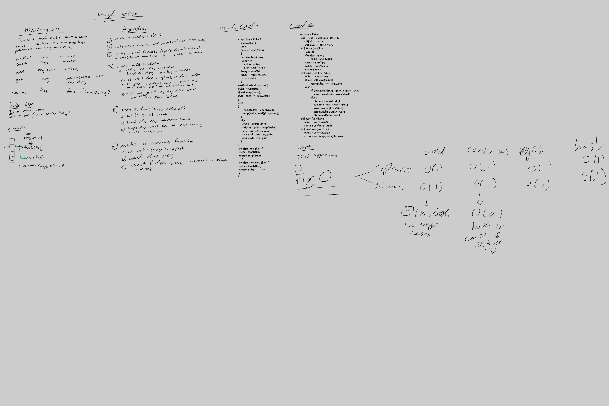

# Hashtables
<!-- Short summary or background information -->
hash table is data structure that implement an associative array abstract data type 

in this example we will make the array associated with linked list 

the benifit of this data structure is its small space and time complixity that we can reach an item imediatly without looping over the array

## Challenge
<!-- Description of the challenge -->
this challenge requires making a has taable with its methods 

hash --> takes a key as an input and return index number 

add --> takes a key and value as an input and add them in the right place in the table 

get --> takes a key as an input and return its value

contains -- > takes a key as an input and return whether this key exist in the hash table or not

## Approach & Efficiency
<!-- What approach did you take? Why? What is the Big O space/time for this approach? -->

### Approach

hash --> loop over the letter and use thier accii code to calculate the index using a certian formula

add --> uses the hash to determin where should the key , value pair put and putt them in thier right place

get --> also uses the hash to calculate the index and return it 

contains -- > also uses the hash to calculate the index and check the key is there or not

### Efficiency

hash --> space O(1) time O(n)

add --> space O(1) time O(n) in the worse case and O(1) if we create a unique hash algorithem

get --> space O(1) time O(n) in the worse case and O(1) if we create a unique hash algorithem

contains -- > space O(1) time O(n) in the worse case and O(1) if we create a unique hash algorithem

## API
<!-- Description of each method publicly available in each of your hashtable -->

hash --> takes a key as an input and return index number 

add --> takes a key and value as an input and add them in the right place in the table 

get --> takes a key as an input and return its value

contains -- > takes a key as an input and return whether this key exist in the hash table or not

## white board 

## Linkes 

[code](hash_table.py)

[test](../tests/test_hash_table.py)