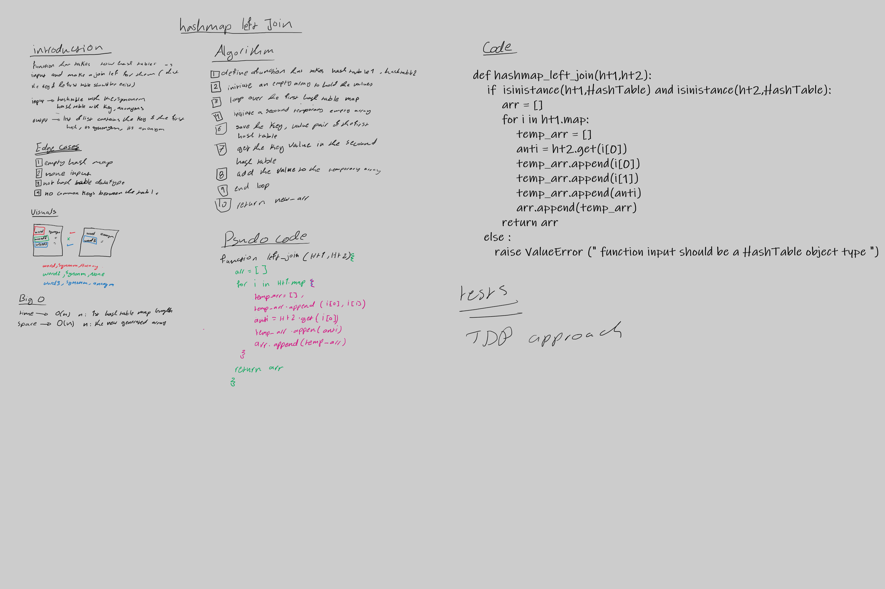

# Hashmap LEFT JOIN
<!-- Short summary or background information -->
the left join means taking the left table keys and make the join between the table depend on them 

so the output will be the key of the left table with its value ,also the value associated with that key in the right table 

## Challenge
<!-- Description of the challenge -->
this challenge require to make a function that make a left join hashmap function that has an 

input --> ht1 which have a key and a synonym  and ht2 which have a key and antonym

output --> an array of arrays each sub array contains key, synonym ,antonym

## Approach & Efficiency
<!-- What approach did you take? Why? What is the Big O space/time for this approach? -->
**approach** 

 treversal approach that the function loop over the first hash table and save its key ,value and the value associated with key in the other table

**Efficiency** 

time --> O(n) n: left ht lenghth 

space --> O(n) n: newly initiated array 

## Solution
<!-- Embedded whiteboard image -->
[code](hashmap_left_join.py)

[test](../tests/test_hashmap_left_join.py)

