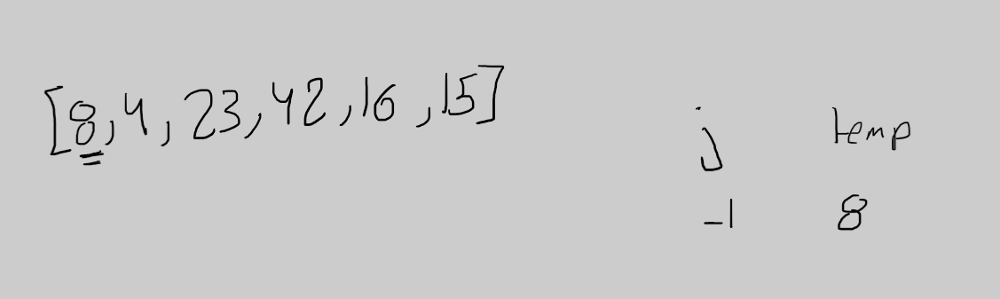
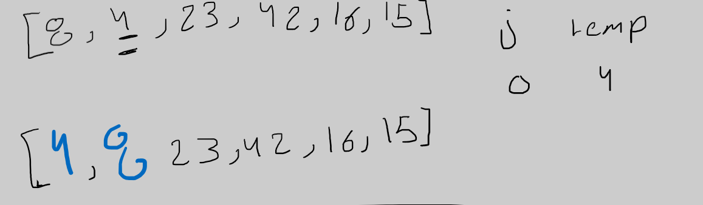
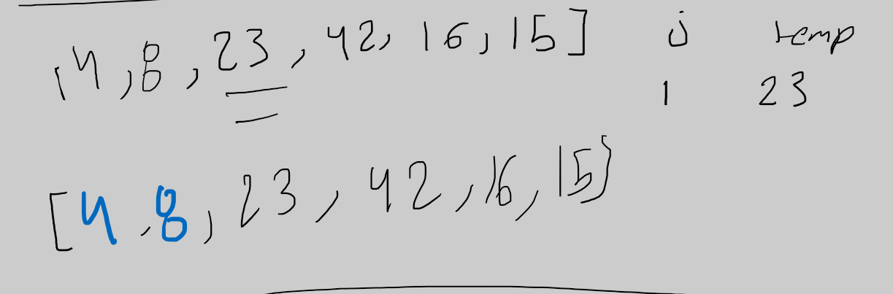
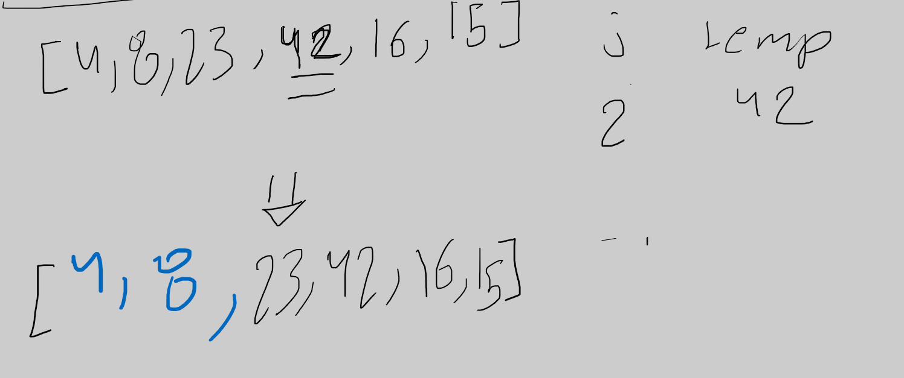
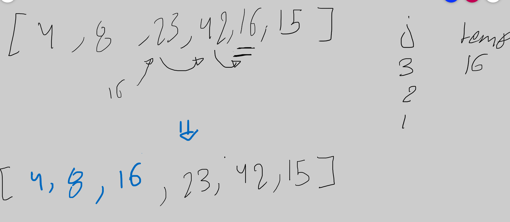
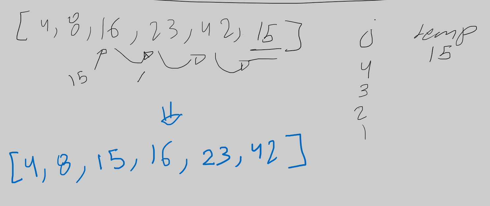

# Insertion Sort blog 

insertion sort work by treverse over the array and devide it to tow supset the sorted and the none sorted supset 
when the number is smaller it keep shifting elements to the left until it reached to its write position 

## Pseudocode

```
  InsertionSort(int[] arr)

    FOR i = 1 to arr.length

      int j <-- i - 1
      int temp <-- arr[i]

      WHILE j >= 0 AND temp < arr[j]
        arr[j + 1] <-- arr[j]
        j <-- j - 1

      arr[j + 1] <-- temp

```

## Trace
lets go step by step in this sample array 

sample array -> [8,4,23,42,16,15]

### Pass 1:



here since the j-1 will be -1 which is less than zero it will not enter the while loop and nothing will be affected 

### Pass 2:



here as we can see the 4 is less than 8 so we loop over the array to shift the 8 one step and then assign the 4 in its position 

### Pass 3:



here the 23 is not less than 8 so it will not enter the while loop so nothing will be affected 

### Pass 4:



the same goes here for 42 since its larger than 23 

### Pass 5:



here the 16 is less than 42 so we start shifting the numbers after saving the 16 in a temp variable ,
so the larger number will be shifted to the right until the 16 is no longer smaler than the privious number . 
after get out of the loop we assign the 16 in the position where the last number shifted from 

### Pass 6:



the same goes here for 15 

now we have a sorted in assending manar 

note : you can turn this to descending sorting just by switshing the temp < arr[j] in the while loop to temp> arr[j]


Efficency
Time: O(n^2)

because we loop over the array twice once in the for loop and once in the while loop (the shifting)

Space: O(1)

No additional space is being created. This array is being sorted in place…keeping the space at constant O(1).


Hope you enjoyed this blog 

Thanks :D 
