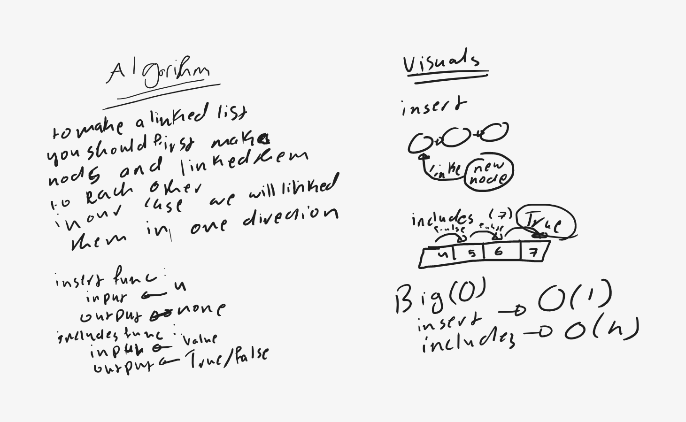
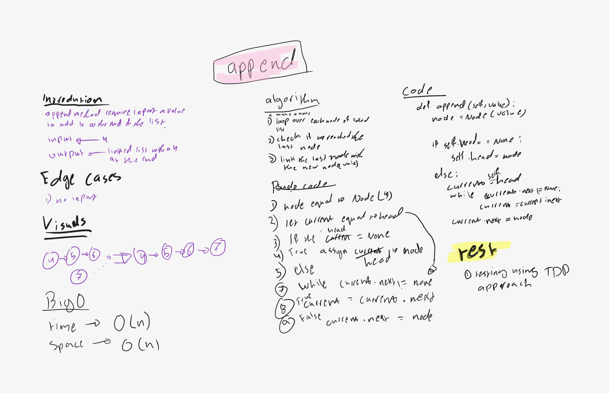
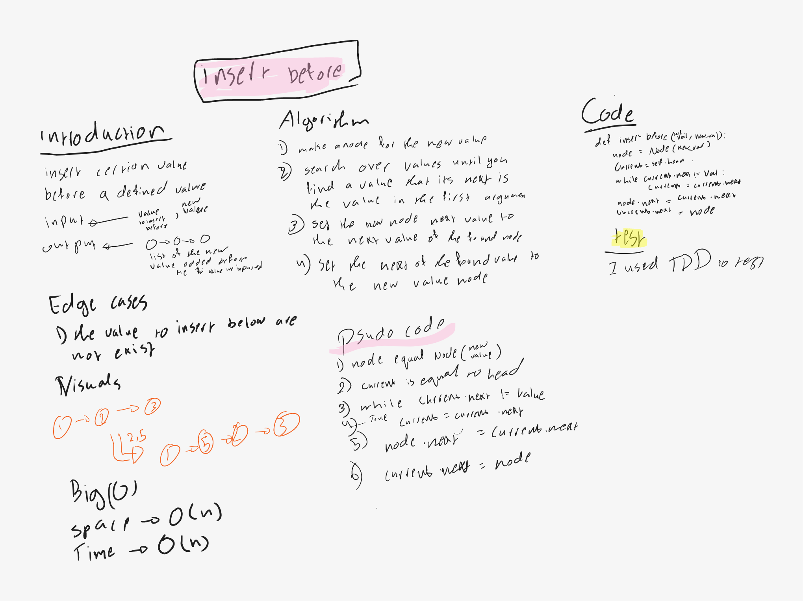
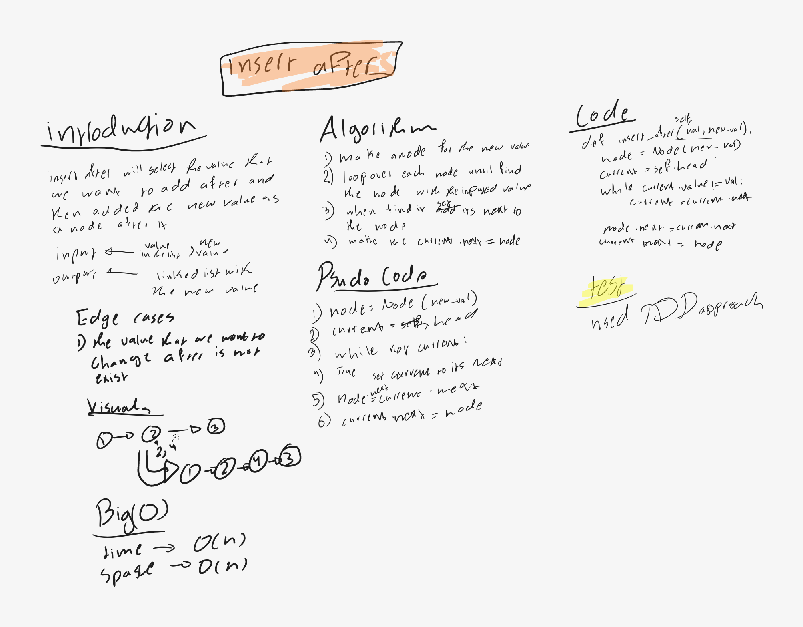

# Singly Linked List
<!-- Short summary or background information -->
the linked list is cosist of nodes with a value and next value 
the next value is linked to another node ...etc 

## Challenge
<!-- Description of the challenge -->
the challenge required making a linked list with insert and string methods 

insert method --> inserting a value in the first of the linked list 

string --> __str__ method to print the class in a custome way

append --> add a new value to the end of linked list

insert_before --> insert a new value before a specific part of linked list

insert_after --> insert a new value after a specific part of linked list

## Approach & Efficiency
<!-- What approach did you take? Why? What is the Big O space/time for this approach? -->
### efficiency

insert --> O(1) time efficency 

includes --> O(n) while n is a the linked list length

__str__ --> O(n) while n is a the linked list length

append --> O(n)

insert_before --> O(n)

insert_after --> O (n)

### approch

insert --> I use assigntment for this method I assigned the new node by the head after linked it with the privious head

includes --> I used iterative methods iterate over each node until I find the value (returns True / False) 

__str__ -->  I used iterative methods iterate over each node and print their values 

append --> TDD approach

insert_before --> TDD approach

insert_after --> TDD aproach

## API
<!-- Description of each method publicly available to your Linked List -->
insert --> it require an input of the value you want to add into the list and output nothing ,but it add the value as on the begining of the list 

includes --> it takes a value as an input and do linear search until it find the value , it returns a True / False

__str__ --> it represent the list in a readable waay in this format "{a}->{b}->{c}" it takes no arguments  

append --> it takes a value as an input and add it at the end of the linked list 

insert_before --> it takes tow argument a value in the position and the new value that we want to add then it add the new value before the positioned value

insert_after --> it takes tow argument a value in the position and the new value that we want to add then it add the new value before the positioned value

## white board 

.png)

.png)

### append method 

### insert_before

### insert_after

