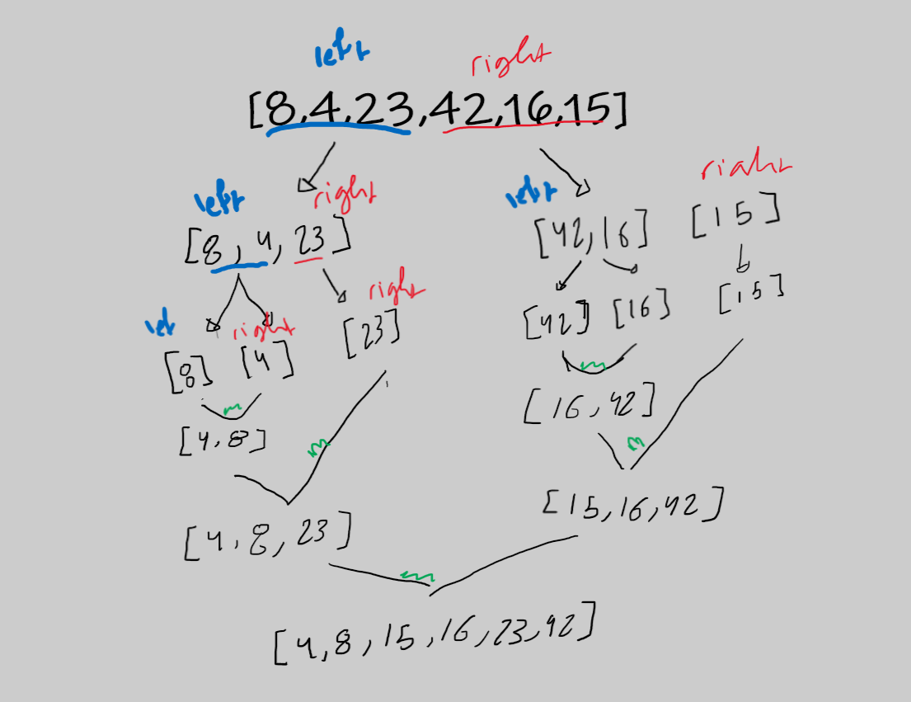

# Merge Sort blog 

this algorithm works by dividig the array to smaler halfs and then merge them again but in sorted way 

## Pseudocode

```
ALGORITHM Mergesort(arr)
    DECLARE n <-- arr.length

    if n > 1
      DECLARE mid <-- n/2
      DECLARE left <-- arr[0...mid]
      DECLARE right <-- arr[mid...n]
      // sort the left side
      Mergesort(left)
      // sort the right side
      Mergesort(right)
      // merge the sorted left and right sides together
      Merge(left, right, arr)

ALGORITHM Merge(left, right, arr)
    DECLARE i <-- 0
    DECLARE j <-- 0
    DECLARE k <-- 0

    while i < left.length && j < right.length
        if left[i] <= right[j]
            arr[k] <-- left[i]
            i <-- i + 1
        else
            arr[k] <-- right[j]
            j <-- j + 1

        k <-- k + 1

    if i = left.length
       set remaining entries in arr to remaining values in right
    else
       set remaining entries in arr to remaining values in left

```

## Trace
lets go step by step in this sample array 

sample array -> [8,4,23,42,16,15]



we keep dividing the array until we reach 1 element for each then we apply the merge function and build our sorted array (we compare each element in the left with the right )

Efficency
Time: O(n*2)

becase of recursion and the while loop inside the function

Space: O(n)

because of recursion stacks

Hope you enjoyed this blog 

Thanks :D 
