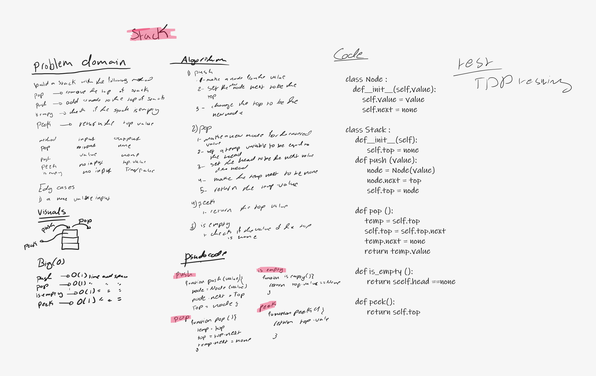
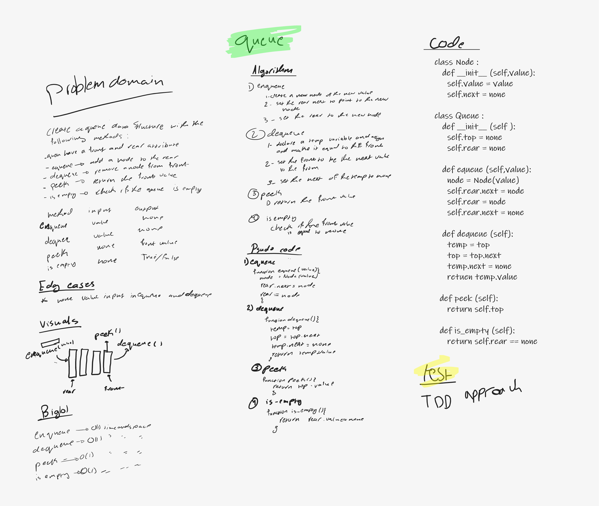

# stack-and-queue

## Challenge
<!-- Description of the challenge -->
this challenge is to make a stack data structure with its methods also to build a queue data structure with its methods 

## Approach & Efficiency
<!-- What approach did you take? Why? What is the Big O space/time for this approach? -->
### efficiency

**stack**

pop --> O(1) thime and space 

push --> O(1) time and space 

peek --> O(1) time and space 

is_empty --> O(1) time and space 

**queue**

enqueue --> O(1) time and space

dequeue --> O(1) time and space

peek --> O(1) time and space

is_empty --> O(1) time and space

### approch

**stack**

pop --> assignment approach I assigned a temrorary variable to the head and then assign the head to the next node of the head and finally assign the next of the temprorary variable to none and return its value 

push --> assignment approach I first inistantiate an instance of a Node class called node then I assigned it next to point to the head then assigned the head to the node  

peek --> calling attribute approach I returned the top value in this method 

is_empty --> comparasion approach checking if the top value is equal to none

**queue**

enqueue --> assigntment approach I first inistantiate an instance of the Node class called node then I assigned the rear next to that node then assign the rear  to that node 

dequeue --> assigntment approach

peek --> calling attribute approach 

is_empty --> comparasion approach 

## API
<!-- Description of each method publicly available to your Linked List -->

**stack**

pop --> its takes nothing as an argument and return the poped value from the top 

push --> it takes a value as an argument and return nothing , but it pushes that value to the stack top 

peek --> its takes no arguments and return the top value as output 

is_empty --> it takes nothing as an input and return a bool  

**queue**

enqueue --> it takes a value as an argument and return nothing , but it pushes that value to the queue rear

dequeue --> its takes nothing as an argument and return the poped value from the front 

peek --> its takes no arguments and return the front value as output 

is_empty --> it takes nothing as an input and return a bool

## white board 

