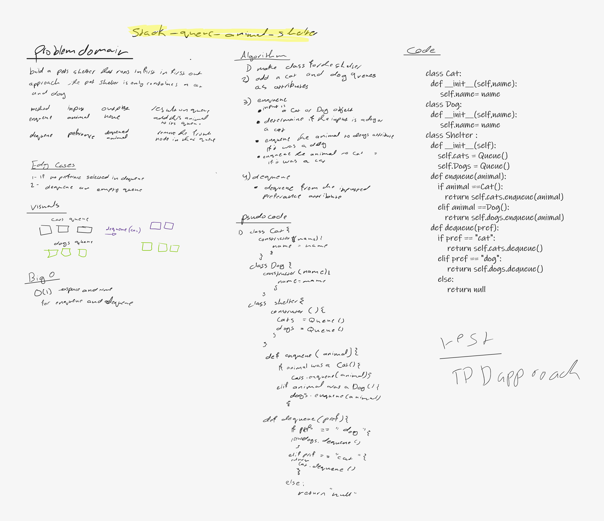

# stack_queue_animal_shelter

# Challenge Summary
<!-- Description of the challenge -->
thes challenge require to make an animal shelter (Cats and Dogs) queue based on user preferance

## Whiteboard Process
<!-- Embedded whiteboard image -->

## Approach & Efficiency
<!-- What approach did you take? Why? What is the Big O space/time for this approach? -->
apporoach 

enqueue --> addind to the wanted queue

dequeue --> remove from prefered queue

Efficiency

enqueue -> O(1) time and space

dequeue -> O(1) time and space

## Solution
<!-- Show how to run your code, and examples of it in action -->
# api

enqueue --> takes animal object as an input and it return nothing , but it will enqueue to the animal category queue 

dequeue --> takes prefered animal as an input and dequeue it from its queue the return it 

used tdd testing approach
