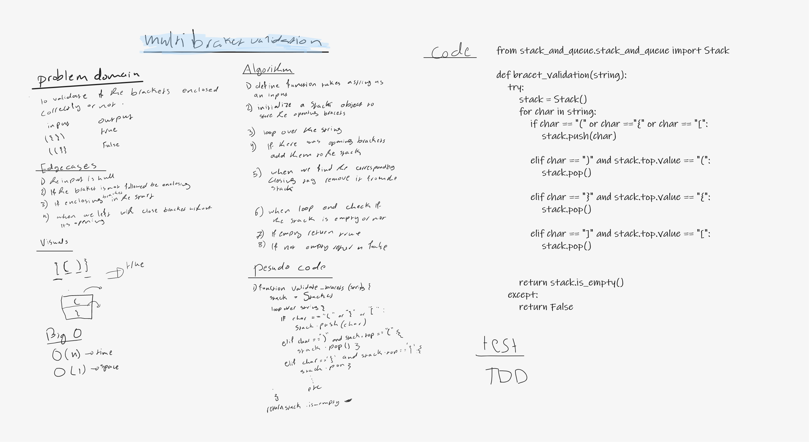

# Challenge Summary
<!-- Description of the challenge -->
this challenge requeres to make sure if the open brackets has its closing pair 

## Whiteboard Process
<!-- Embedded whiteboard image -->

## Approach & Efficiency
<!-- What approach did you take? Why? What is the Big O space/time for this approach? -->
I used a stack data structure to solve this problem becase of its LIFO propertey so I can keep track of the open bracet by adding them to thw stack and remove them when it meet its closing bracket

BigO

O(1) --> space
O(n) --> time

## Solution
<!-- Show how to run your code, and examples of it in action -->
bracet_validation --> takes a string as input and return True if all brackets has its closing and False if there is somthing wronge with them 

Test --> TDD approach 

[the code link](stack_queue_brackets.py)

[the test link](../tests/test_stack_queue_brackets.py)
