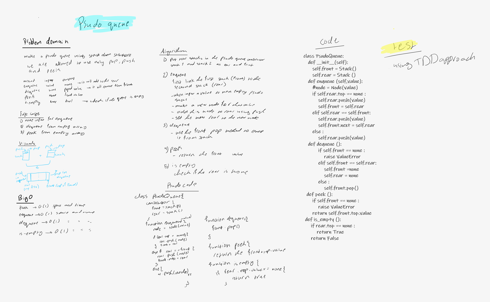

# Challenge Summary
<!-- Description of the challenge -->
this challenge is to make a pseudo queue using two stacks 

## Whiteboard Process
<!-- Embedded whiteboard image -->

## Approach & Efficiency
<!-- What approach did you take? Why? What is the Big O space/time for this approach? -->
### big O
enqueue --> O(n) time and space

dequeue --> O(1) time and space

peek --> O(1) time and space

is_empty --> O(1) time and space

### aproach

enqueue --> moving data from the first stack to the second one then push the value to the first one the return the values putted in stack2 to the stack one so they become in order of first in first out 

dequeue --> assigntment approach

peek --> calling attribute approach 

is_empty --> comparasion approach 

## API
<!-- Description of each method publicly available to your Linked List -->

**stack**

pop --> its takes nothing as an argument and return the poped value from the top 

push --> it takes a value as an argument and return nothing , but it pushes that value to the stack top 

peek --> its takes no arguments and return the top value as output 

is_empty --> it takes nothing as an input and return a bool  

**queue**

enqueue --> assigntment approach I first inistantiate an instance of the Node class called node then I assigned the rear next to that node then assign the rear  to that node 

dequeue --> assigntment approach

peek --> calling attribute approach 

is_empty --> comparasion approach 

## Solution
<!-- Show how to run your code, and examples of it in action -->
### Api 
enqueue --> it takes a value as an argument and return nothing , but it pushes that value to the queue rear

dequeue --> its takes nothing as an argument and return the poped value from the front 

peek --> its takes no arguments and return the front value as output 

is_empty --> it takes nothing as an input and return a bool

[code](stack_queue_pseudo.py)

[test](../tests/test_stack_queue_pseudo.py)

