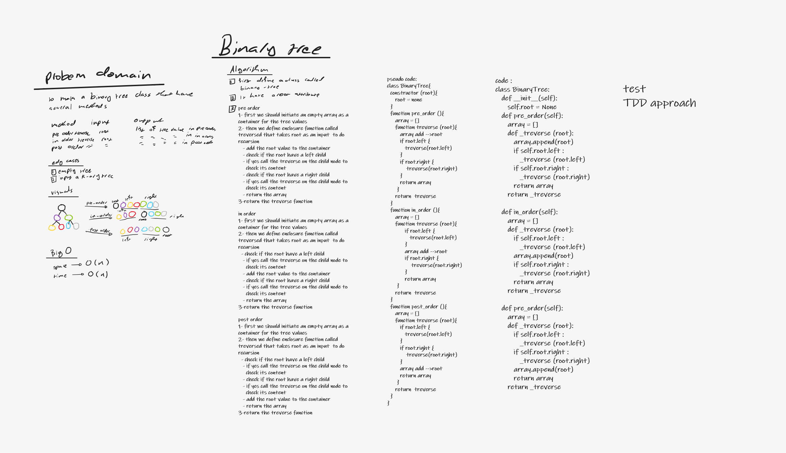
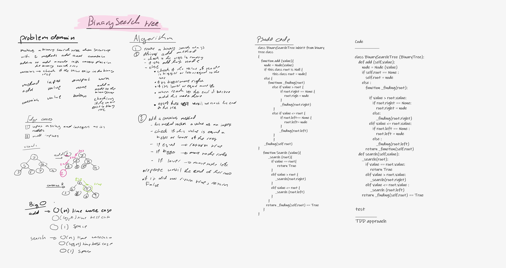
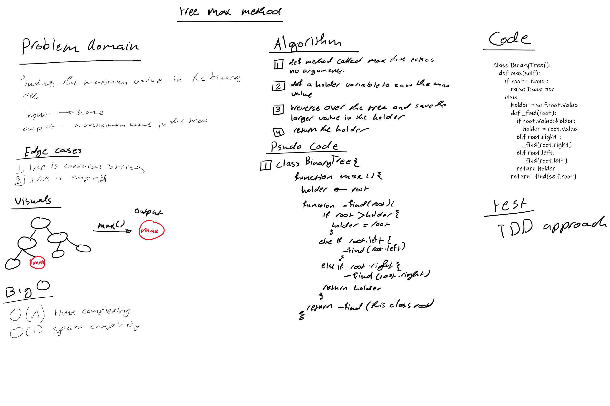

# Trees
<!-- Short summary or background information -->
<span style="color:#0a786d">**Binary Tree**</span>
:
 is a data structrre that contains of nodes each node can point to tow nodes only (left ,right) 
tree have a root value ehich is the head or the begining of the tree 

also it contains leafs which exist at the end of the trees and dont point to other nodes 

<span style="color:#0a786d">**Binary Search Tree**</span>
: it is a subtype of the binary tree that follow a binary search roules (bigger in thr right and smaller on the left)


## Challenge
<!-- Description of the challenge -->
this challenge requre making a binary tree and a binary search tree 

- binary tree 

    it consist of nodes each node have a value and left and right 

    it have treversals methods :

        1- pre_order
        2-in_order
        3- post order
    
    it also have 

        1- max method --> which return the max value 
     
- binary search

    tree which is consist of a root and the bigger value goes to the right and the smaller or equal value goes to the left 
        
    it have these methods :

        1- add -> add a node to its correct position in the binary tree 
        2- contains -> check the value if it exist in the tree at least once 


## Approach & Efficiency
<!-- What approach did you take? Why? What is the Big O space/time for this approach? -->
<span style="color:#0a786d">**Binary Tree**</span>

<span style = "text-decoration:underline">Approach</span>


pre order treversal --> used recursion to iterate over every element and add it to list , finaly displayed the list 

in order treversal --> used recursion to iterate over every element and add it to list , finaly displayed the list 

post order treversal --> used recursion to iterate over every element and add it to list , finaly displayed the list 

max --> used recursionto iterate over every element and compare it with a holder variable and keep assigning the larger value to it 

<span style = "text-decoration:underline">Efficiency</span>

pre order treversal --> O(n) time ,O(n)space 

in order treversal --> O(n)time ,O(n)space

post order treversal --> O(n) time and space 

max --> O(n) time , O(1) space

<span style="color:#0a786d; ">**Binary Search Tree** </span>

<span style = "text-decoration:underline">Approach</span>

add --> used recursion to iterate over the nodes in the binary search tree roles and when reached to the last node the new value will be added correctly to it 

contains --> used recursion to iterate over the nodes in the binary search tree roles and when reached to the wanted value true will be returned  

<span style = "text-decoration:underline">Efficiency</span>

add ->

```
1- O(n) worse case time
2- O(log2n) normal case time 
3- O(1) space 
``` 

contains 

```
1- O(n) worse case time
2- O(log2n) normal case time 
3- O(1) space 
``` 

## API
<!-- Description of each method publicly available in each of your trees -->

<span style="color:#0a786d">**Binary Tree**</span>

pre order treversal --> this method require no inputs and it return an array with the tree values in pre order  

in orded treversal --> this method require no inputs and it return an array with the tree values in on order 

post order treversal --> this method require no inputs and it return an array with the tree values in post order

max --> this method require no inputs and return the maximum value in the tree as an output 

<span style="color:#0a786d; ">**Binary Search Tree** </span>

add --> this method require a value as an input and it have no output , it added a new node to the binary search tree in its right position 

contains -->  this method require a value as an input and return True / False as output 

## white board 





Max 


## linkes 

[the code](tree.py)

[testing](../tests/test_tree.py)