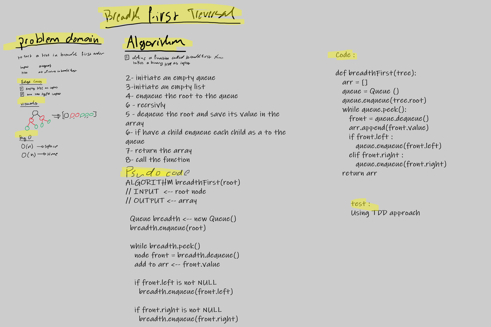

# Challenge Summary
<!-- Description of the challenge -->
to make a function thats treverse a tree in a breadth first order 

## Whiteboard Process
<!-- Embedded whiteboard image -->

## Approach & Efficiency
<!-- What approach did you take? Why? What is the Big O space/time for this approach? -->
approach --> use a queue to control the sort and an arr to save the values 

efficiency :

    O(n) --> space and time 

## Solution
<!-- Show how to run your code, and examples of it in action -->
it takes a tree as an input and return an arr with a breadth first order 

[code](tree_breadth_first.py)

[test](../tests/test_tree_breadth_first.py)