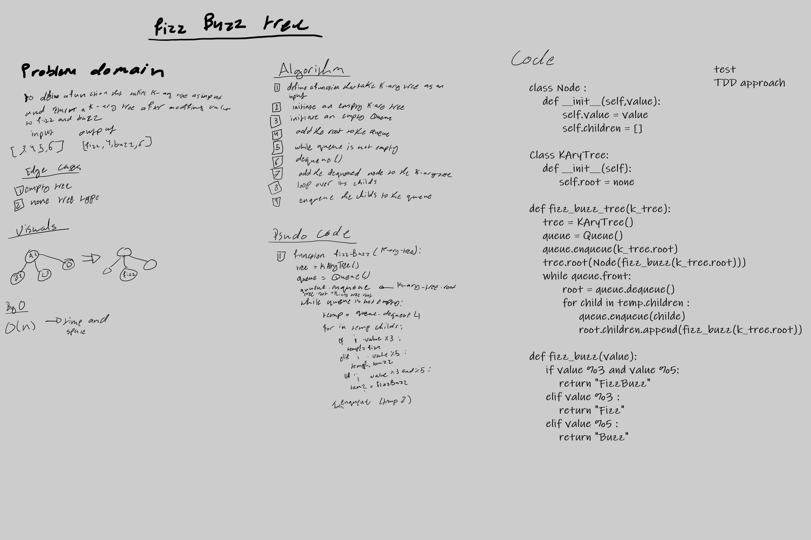

# Challenge Summary
<!-- Description of the challenge -->
make k-ary tree then write a function to treverse it and replace every num divisable by 3 to fizz ,
 replace every num divisable by 5 to fizz, replace every num divisable by 3 and 5 to FizzBuzz, if noe divisable by 3 and 5 return the num as a string

## Whiteboard Process
<!-- Embedded whiteboard image -->

## Approach & Efficiency
<!-- What approach did you take? Why? What is the Big O space/time for this approach? -->
approach --> use a queue to treverse over the k-ary tree and use k-ary tree to transfer the values

efficacy 

O(n)--> time and space

## Solution
<!-- Show how to run your code, and examples of it in action -->
