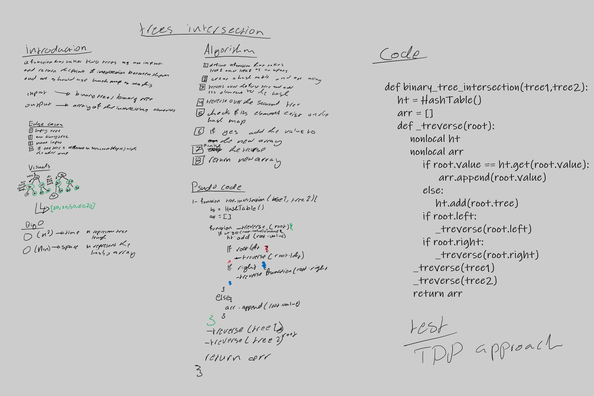

# Challenge Summary
<!-- Description of the challenge -->
this challenge require us to define a function that takes two binary trees as an input and return a set of element exists in both trees 

input --> tree1,tree2

output --> set of intersecting elements 

## Whiteboard Process
<!-- Embedded whiteboard image -->

## Approach & Efficiency
<!-- What approach did you take? Why? What is the Big O space/time for this approach? -->

**approach**

in this challenge it used the treversal approach that it treverse over the tow trees and when any node have existed value the function adds its value to an array  

**eficaacy**

time -> O(n+n) n represent the tree length 

space -> O(n+n+n) n represent 1- the hashmap 2- the array 3- the stackes made by recursion

## Solution
<!-- Show how to run your code, and examples of it in action -->

[code](tree_intersection.py)

[tests](../tests/test_tree_intersection.py)
